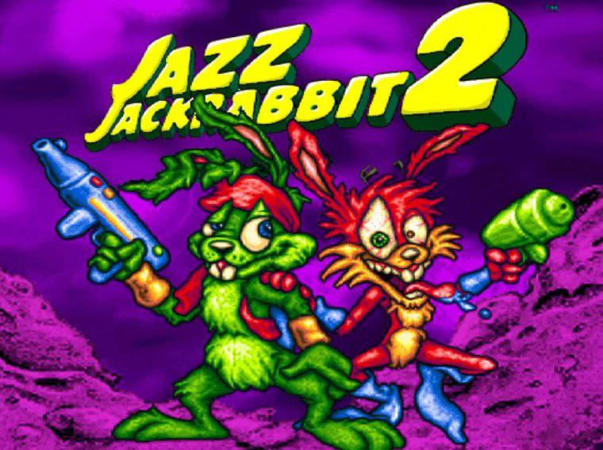

# Jazz Jackrabbit 2



## Comenzando 🚀

### Pre-requisitos 📋

Antes que nada, asegurate de correr el `installer.sh` que se encargará de bajar todas las librerías y dependencias necesarias para correr el juego.

Luego, será necesario crear una carpeta build usando: `mkdir build`. (En caso de tenerla previamente, borrarla con `rm -r build` y luego crearla nuevamente).

Se tiene que entrar en la carpeta creada con: `cd build`.

Una vez adentro de la carpeta build, se tiene que crear el archivo makefile usando el comando: `cmake ../`.

Por último, se compila el programa con el comando `make`.

Para ejecutar el servidor o cliente siempre hay que estar en la carpeta build [para más información sobre cómo correr el juego, vaya a "A jugar"]

### A jugar 🎮

Vamos a necesitar de 1 consola para el server:

```shell
./server <puerto>
```

y luego de 1 consola por cada cliente que quiera conectarse al juego:

```shell
./client <IP> <puerto>
```

### Elige tu personaje 🐰

Elige tu personaje sabiamente, cada uno tiene una habilidad especial diferente:

#### Jazz 🟢

Acción especial: *Puñetazo hacia arriba* - Jazz puede hacer un salto vertical, sin posibilidad de moverse lateralmente, pero realizando un daño con todo lo que toque.

#### Spazz 🔴

Acción especial: *Patada hacia un costado* - Spazz puede hacer hacer una patada que la desplaza de forma lateral, sin poder saltar hacia arriba, realizando un daño con todo lo que toque.

#### Lori 🟡

Acción especial: *Patada de corto alcance* - Lori puede hacer un patada voladora de corto alcance mientras da un salto (tal como si fuese una accion de salto), realizando un daño con todo lo que toque.

### Comandos ⌨️

    ⬅️     =  Correr izquierda

ctrl + ⬅️  =  Correr izquierda rapido

    ➡️     =  Correr derecha

ctrl + ➡️  =  Correr derecha rapido

    ⬆️     =  Saltar

     A     =  Disparar
            
     S     =  Accion especial
            
    ⬇️    =  Cambiar arma

### Reglas 📜

⏳ La partida dura 5 minutos.

🏆 Gana el jugador que haya recaudado la mayor cantidad de puntos en ese lapso de tiempo.

💎 Los puntos se pueden obtener al coleccionar monedas, gemas o matar enemigos.

⚔️ Ten cuidado! Si tocas los enemigos perderas vidas!

🥕 Las zanahorias te darán vidas extras.

🥴 Ten cuidado con la comida! Si te intoxica podrás moverte, pero no disparar.

### Armas

🔫 Empiezas con el arma inicial, que no tiene límite de munición. Al matar enemigos podrás juntar municiones de las demás armas e ir cambiando de arma.

### Enemigos

🦘 Gigante amarillo: Enemigo de tierra

🐁 Rata loca: Enemigo de tierra

🦇 Murcielago rabioso: Enemigo volador

### Cheats 🤫

K = Kill all

### Musica / Sonidos 🔊

🚧 En construcción 🚧

## Ejecutando las pruebas ⚙️

En la misma carpeta de build que creamos para correr el juego, vamos a abrir 2 consolas.

En una corremos: `./protocol_server_test`

Y en la otra corremos: `./test_consola_cliente`

Nota: Debido a que hay que crear muchos sockets para las pruebas, se recomienda ir comentando las pruebas y correrlas 1 a la vez para asegurarse de que se crean correctamente los sockets y evitar falsos negativos.

## Construido con 🛠️

* [C++](https://cplusplus.com)
* [SDL2](https://www.libsdl.org/)
* [Makefile](https://www.gnu.org/software/make/manual/make.html)
* [CMake](https://cmake.org/)
* [YAML](https://yaml.org/)
* [Gtest](https://github.com/google/googletest)

## Autores ✒️

* **Camila Belén Sebellin** - 100.204 - [camiSebe](https://github.com/camiSebe)
* **Pablo Martin Alejando** - 98.021 - [Pabloale96](https://github.com/Pabloale96)
